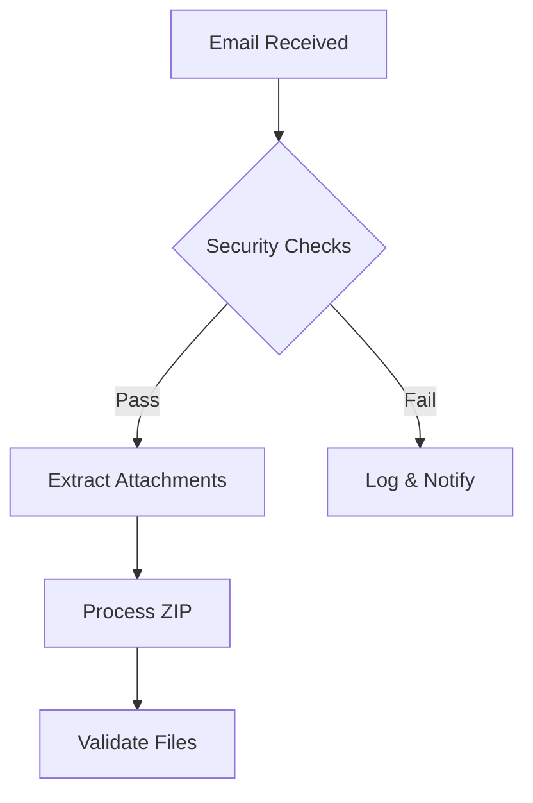
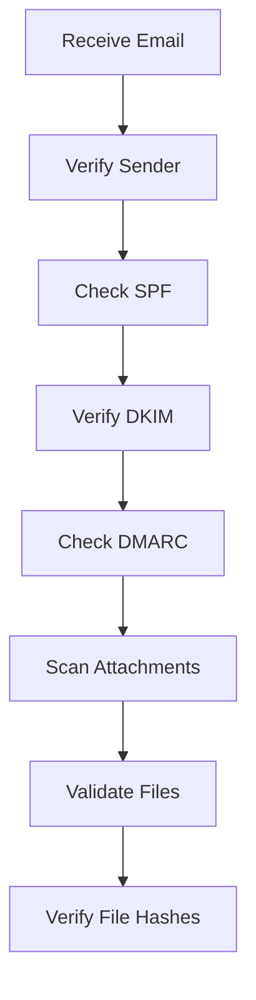

# Technical Documentation

## Core Concepts

### Purpose
The ETL processor is designed to handle automated data imports from email attachments. It's built to be completely configuration-driven, allowing different import types without code changes.

### Key Features
- Asynchronous email processing
- Configuration-driven mappings
- Reference data handling
- Security validation
- File hash tracking for idempotency
- Interactive CLI with progress visualization
- Comprehensive error handling and notifications
- Support for both XML and JSON data formats
- Flexible Date Parsing

## Date Parsing Capabilities

### Supported Date Formats

The data converter provides robust date and datetime parsing with multiple strategies:

1. Flexible Automatic Parsing
```yaml
# No specific format - uses intelligent parsing
created_at:
  type: datetime  
  # Supports formats like:
  # - 2025-02-04 15:59:00
  # - 04-02-2025 15:59:00
  # - 2025/02/04
  # - 04.02.2025
```

2. Explicit Format Specification
```yaml
# Specify exact parsing format for precision
processed_at:
  type: datetime
  format: "%Y-%m-%d %H:%M:%S"  # ISO format
  # Or
  format: "%d-%m-%Y %H:%M:%S"  # Day-Month-Year format
```

#### Parsing Strategies

1. **Default (Flexible) Parsing**
   - Uses `dateutil.parser` for intelligent parsing
   - Handles multiple international date formats
   - Supports various separators (-, /, .)
   - Automatically detects date structure

2. **Specific Format Parsing**
   - Allows exact format specification
   - Resolves ambiguity in date representations
   - Provides precise control over parsing

#### Date Specifiers
- `%Y`: 4-digit year (2025)
- `%m`: 2-digit month (02)
- `%d`: 2-digit day (04)
- `%H`: Hour in 24-hour format (15)
- `%M`: Minutes (59)
- `%S`: Seconds (00)

#### Configuration Examples
```yaml
mappings:
  data.xml:
    fields:
      # Flexible parsing
      created_at:
        type: datetime  # Automatic detection
      
      # Explicit ISO format
      processed_at:
        type: datetime
        format: "%Y-%m-%d %H:%M:%S"
      
      # Day-Month-Year format
      registration_date:
        type: date
        format: "%d-%m-%Y"
```

#### Parsing Precedence
1. Specified `format` in configuration
2. Flexible dateutil parsing
3. Predefined fallback formats
4. Returns `None` if no parsing succeeds

### Error Handling
- Gracefully handles parsing failures
- Returns `None` for invalid dates
- Logs warnings for parsing issues
- Provides detailed error information

### Use Cases
- Handling international date formats
- Processing legacy or inconsistent data sources
- Providing flexibility in data imports
- Ensuring robust date parsing across different systems

## Data Flow

### 1. Email Processing


#### Email Structure Example
```text
From: authorized@example.com
Subject: Data Import
Attachment: data.zip
  ├── reference1.xml
  ├── reference2.xml
  └── main_data.xml
```

Required Email Headers:
```text
Return-Path: <sender@domain.com>
Authentication-Results: dkim=pass; spf=pass; dmarc=pass
X-Spam-Status: score=<threshold
Content-Type: multipart/mixed
```

### 2. Security Processing


#### Security Configuration Example
```yaml
security:
  email_checks:
    - sender_domain
    - spf
    - dkim
    - dmarc
  allowed_sender_domains:
    - example.com
    - trusted-domain.com
  spam_threshold: 5.0
  file_validation:
    max_size: "50MB"
    allowed_types:
      - application/xml
      - application/zip
      - text/xml
      - application/json
    zip_extraction:
      max_ratio: 15
      max_files: 100
      max_file_size: 50MB
```

### 3. Reference Data Processing

Reference data must be processed in order due to foreign key dependencies. The system supports both XML and JSON formats.

#### Example XML Reference
```xml
<reference>
  <item>
    <id>1</id>
    <name>Example</name>
    <parent_id>5</parent_id>
  </item>
</reference>
```

#### Example JSON Reference
```json
{
  "id": 1,
  "name": "Example",
  "parent_id": 5,
  "metadata": {
    "created": "2024-01-30T12:00:00",
    "source": "import"
  }
}
```

#### Corresponding Database Schema
```sql
CREATE TABLE reference (
  id INT PRIMARY KEY,
  name VARCHAR(255),
  parent_id INT,
  created DATETIME,
  modified DATETIME,
  FOREIGN KEY (parent_id) REFERENCES parent_table(id)
);
```

#### Mapping Configuration
```yaml
mappings:
  "reference.xml":
    table: "reference"
    fields:
      id: 
        db_field: "id"
        type: "integer"
      name:
        db_field: "name"
        type: "string"
      parent_id:
        db_field: "parent_id"
        type: "integer"
```

### 4. File Hash Tracking
```json
{
  "processed_files.json": {
    "reference1.xml": {
      "hash": "sha256_hash_value",
      "last_processed": "2024-01-30T12:00:00",
      "status": "success",
      "records_processed": 150
    },
    "reference2.xml": {
      "hash": "sha256_hash_value",
      "last_processed": "2024-01-30T12:05:00",
      "status": "success",
      "records_processed": 75
    }
  }
}
```

## Implementation Details

### Progress Visualization
The system provides real-time progress updates through an interactive CLI:
```python
class InteractiveDisplay(DisplayBase):
    """Interactive display handler with progress bars"""
    def __init__(self):
        self.progress = MultiProgress()
        self.setup_stages()
    
    def setup_stages(self):
        """Setup processing stages"""
        self.progress.add_stage('init', 'Initializing Import')
        self.progress.add_stage('download', 'Loading Email Attachment')
        self.progress.add_stage('extract', 'Extracting Files')
        self.progress.add_stage('process', 'Processing Files')
        self.progress.add_stage('parse', 'Parsing Data')
        self.progress.add_stage('save', 'Saving to Database')
```

### Asynchronous Processing
The system uses asyncio for:
- Parallel email processing
- Non-blocking file operations
- Concurrent security checks

Example:
```python
async def process_email(email_msg):
    security_result = await verify_security(email_msg)
    if security_result:
        extracted_files = await extract_attachments(email_msg)
        await process_files(extracted_files)
```

### Error Handling Strategy
1. Base Error Handling:
```python
def handle_error(self, message: str, error: Exception, session: Optional[Session] = None):
    """Handle errors consistently"""
    if not self.is_cron:
        self.logger.error(f"{message}: {str(error)}", exc_info=True)
    
    if session:
        session.rollback()
    
    if self.display:
        self.display.error(message)
    
    return error
```

2. Data Type Conversion:
```python
def convert_field(value: Any, field_type: str, field_format: Optional[str] = None) -> Any:
    """Convert field value based on configuration"""
    try:
        if field_type == 'string':
            return str(value).strip() if value else None
        elif field_type == 'integer':
            return int(str(value).strip())
        elif field_type == 'date':
            return _convert_date(value, field_format)
        # ... other conversions
    except Exception as e:
        logger.error(f"Conversion error: {str(e)}")
        return None
```

3. Security Validation:
```python
async def verify_email_security(self, email_msg, import_type: str) -> Dict[str, bool]:
    """Verify email security based on import-specific configuration"""
    security_config = self.config_loader.get_security_rules(import_type)
    results = {
        'sender_verified': False,
        'spf_pass': False,
        'dkim_pass': False,
        'dmarc_pass': False,
        'malware_scan_pass': False
    }
    # ... implementation details
```

### Database Operations
The system uses SQLAlchemy with connection pooling and transaction management:
```python
def get_db_session():
    """Create database session"""
    host = os.getenv('MYSQL_HOST')
    port = os.getenv('MYSQL_PORT_INTERNAL', '3306')
    database = os.getenv('MYSQL_DATABASE')
    user = os.getenv('MYSQL_USER')
    password = os.getenv('MYSQL_PASSWORD')

    db_url = f"mysql+mysqlconnector://{user}:{password}@{host}:{port}/{database}"
    engine = create_engine(db_url)
    Session = sessionmaker(bind=engine)
    return Session()
```

## Development Standards

### Code Style
- All Python code must include docstrings following Google style
- Functions, methods, and classes must be documented
- Type hints must be included for all parameters and return values
- Example:
```python
def process_data(input_data: List[Dict[str, Any]], config: Config) -> ProcessingResult:
    """Process input data according to configuration.

    Args:
        input_data: List of dictionaries containing the raw data to process.
        config: Configuration object containing processing rules.

    Returns:
        ProcessingResult object containing the processed data and any errors.

    Raises:
        ValidationError: If input data fails validation.
    """
    ...
```

### Documentation Requirements
- Module-level docstrings must describe the module's purpose and any important notes
- Class docstrings must document the class purpose, attributes, and usage
- Method docstrings must include:
  - Brief description
  - Args section with all parameters
  - Returns section describing return value
  - Raises section listing any exceptions
- Complex algorithms should include implementation notes and examples

## Debugging Guide

### CLI Debugging
- Use `--debug` flag for detailed progress information
- Progress visualization available in interactive mode
- Error details shown in console with stack traces

### Email Processing Debug Steps
1. Check email headers in logs
2. Verify security validation results
3. Monitor file extraction process
4. Review database transaction logs

### Common Error Patterns
1. Email Security:
   - Invalid DKIM signatures
   - SPF record mismatches
   - DMARC policy failures
   
2. File Processing:
   - ZIP extraction failures
   - Invalid file hashes
   - XML/JSON parsing errors
   
3. Database:
   - Foreign key violations
   - Transaction deadlocks
   - Connection pool exhaustion

---